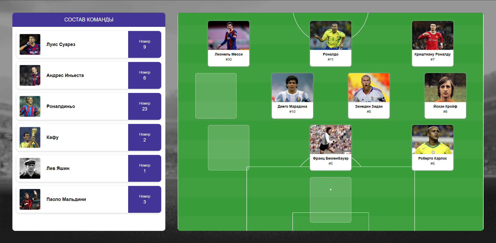

# Vsporte App

# Angular
Используемая версия - Angular v17.01

Для запуска используйте команду "ng serve"

# Инструкция для пользователя
Функции приложения основаны на использовании Drag and Drop, или же перетягивания элементов.
- Чтобы разместить игрока на поле, перетяните его из списка на нужную позицию.
- Чтобы заменить игрока на поле игроком из списка, перетяните игрока из списка в область игрока, которого хотите заменить.
- Чтобы убрать игрока с поля, перетяните его в список игроков.
- Для смены позиций игроков на поле просто перетягивайте их в нужную область. Игроки изменят позиции автоматически.
